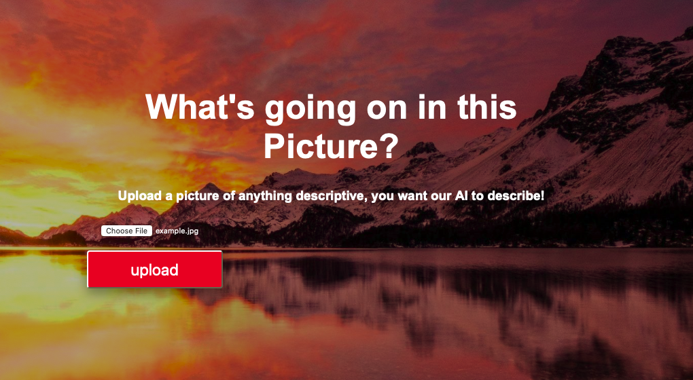
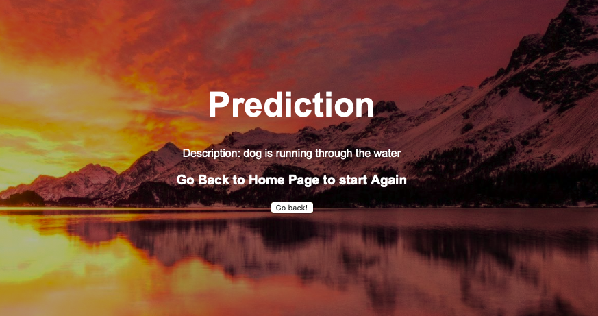

# Whats going on in the Picture

AI describing an Image.

Check out the app : [Whats going on in the Picture](https://whats-going-on-in-the-picture.herokuapp.com/)

While deploying an app on Heroku, these two points are very important:

1. **Slug Size:** Heroku provides a max slug size of 500 MB, the total data an app can hold after compression.

2. **Request TimeOut:** Due to large sized pre-trained model the PUT request can show time out and app wont land to result page.

You can also try deploying it on AWS, Paperspace or GCloud but they all charge you per hour for the machine and for the storage, Heroku is better option comparatively.
